# SCION 25G Workstation


This is an LGA4677 socket and it's about to be fitted with a 12-core Intel Xeon
CPU to power the 64 PCIe Gen5 lanes for 3x Mellanox NVIDIA BlueField-2 Dual-25G
smart NICs, which will ultimately power the SCION Association's new 25 Gbit/s
testbench workstation!

I built it to develop and test a new AF_XDP underlay for the
[SCION OSS](https://github.com/scionproto/scion) border router to improve dataplane performance,
especially in high bandwidth scenarios.

In this article, I'll walk you through the entire planning, building, and
configuration process in almost full detail.

It's hard to say how many hours I spent on it.
In total it cost us CHF ~3,741.34 (around ≈$4,700 USD) in materials.
See the [complete list of components](#complete-components-list) at the end.

Disclaimer: I spent many hours writing this article by hand, but I must confess,
LLMs did help me formulate and polish parts of it.

## Background

### SCION

SCION
(**S**calability, **C**ontrol, and **I**solation **O**n Next-Generation **N**etworks),
is, in a nutshell, an IETF draft-stage technology of a growing alternative to the
[Border Gateway Protocol (BGP)](https://en.wikipedia.org/wiki/Border_Gateway_Protocol).
It's a new inter-[AS](https://en.wikipedia.org/wiki/Autonomous_system_(Internet))
routing architecture designed to address BGP's fundamental flaws and security
vulnerabilities.

Maybe at some point in the distant future the Internet will run SCION. Most likely
though, SCION and BGP will run side-by-side.
What is clear, though, is that critical infrastructure should run on SCION,
where:

- path authenticity
- explicit path control (e.g. geofencing)
- more consistent latency characteristics
- deterministic failover
 
are required and best-effort BGP routing is an unacceptable risk.

The national bank of Switzerland realized this and since 2024
Switzerland's banking infrastructure now runs on the SCION-powered
[SSFN](https://www.six-group.com/en/products-services/banking-services/ssfn.html),
which relies on the proprietary implementation from
[Anapaya Systems AG](https://www.anapaya.net/) that currently provide up to 100 Gbit/s
border router solutions. The free open source implementation
[github.com/scionproto/scion](https://github.com/scionproto/scion) received numerous
dataplane performance improvements over the past years but is still lagging behind.

If we want to do video calls (and similar high-bandwidth use cases) over
SCION OSS en masse - dataplane performance needs to improve.
Thanks to funding by the [NLnet Foundation](https://nlnet.nl/) we've been working on a new
faster [AF_XDP](https://docs.kernel.org/networking/af_xdp.html) border router underlay.

If you want to learn more about SCION, check out [scion.org](https://www.scion.org).

### Border Router Performance

As of the time of writing, the SCION OSS border router performance reached a ceiling of
around 400k-500k packets per second, which is roughly equivalent to 5-6 Gbit/s
at a 1500-byte [MTU](https://en.wikipedia.org/wiki/Maximum_transmission_unit).

5 Gbit/s per stream\* of data is too little, in fact, way too little.
By contrast, today's Internet carries traffic on the order of
**hundreds of terabits per second** across BGP border routers worldwide.
On the higher end, take the Juniper "MX10008 Universal Routing Platforms" with up to
**76.8 Tbps** (yes, terabits with twelve zeroes) of total bandwidth capacity for example

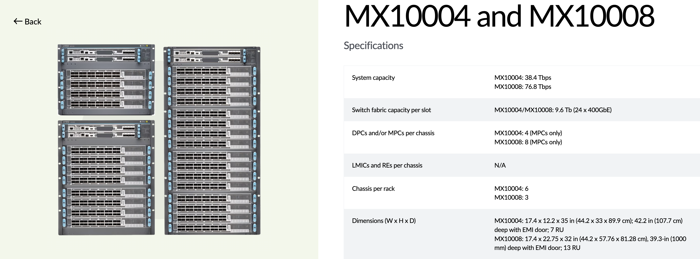

These kinds of systems support per-port line rates of 400–500 Gbit/s, depending on the
interface configuration. Individual packet streams carried over such ports can therefore
be forwarded at or near full line rate without being bottlenecked by software overhead,
while massive parallelization across ports enables aggregate bandwidths in the
terabits per second.

Such routers usually sit at
[Internet exchange points](https://en.wikipedia.org/wiki/Internet_exchange_point)
and interconnect
[Internet service providers](https://en.wikipedia.org/wiki/Internet_service_provider).
They can easily handle from tens of millions to even billions of packets per second.

Even my local ISP now provides 25 Gbit/s
[FTTH](https://en.wikipedia.org/wiki/Fiber_to_the_x) connections at my small town
near Zurich city.

SCION OSS needs to do better; a lot better.

*\* A "stream" is defined here as an flow of packets from a specific source address to
a specific destination address that cannot be parallelized across multiple threads as
parallelization would cause unacceptable levels of packet reordering.*

### The Linux Networking Stack

The SCION OSS border router is a Linux user-space program.
It relies solely on the Linux Networking Stack.


*Schematic for the packet flow paths through Linux networking and tables by Jan Engelhardt*

You can think of a packet traversing the networking stack as a person traveling by airplane:
- you enter the airport (Network Interface Controller receiving queue)
- you check in and drop off your baggage (buffer allocations)
- you pass security screening (packet filtering)
- you clear passport control (routing and policy checks)
- you wait at the gate (queueing and scheduling)
- you board the aircraft (copy to user space)
- you find your seat (user-space buffer) and you're finally ready for takeoff!

And when transiting - like a packet passing through a router - the same sequence of steps
occurs again in reverse on the transmit path.

As you can probably tell, there's a lot of work between a packet entering one NIC and
exiting on another.

We could improve the throughput by adding more router threads, but this would introduce
substantial packet reordering, with packets leaving the system in a different and largely
unpredictable order. High frequency of reordering degrades performance and increases
system resource usage, making this approach non-viable.

The only real way to further improve the OSS Data plane performance is to bypass the Linux
kernel's networking stack and fly by private jet:

- you enter the airport (Network Interface Controller)
- you're escorted directly to your private jet (zero-copy fast path to XSK)
- you board the plane and you're done (user-space frame buffer)

There are several ways in which you can bypass the kernel, namely:

- [DPDK](https://www.dpdk.org/): a user-space networking framework that bypasses the
  Linux networking stack entirely, typically requiring exclusive control over the NIC and
  removing it from the kernel's standard networking stack.
- [AF_XDP](https://docs.kernel.org/networking/af_xdp.html): a Linux kernel mechanism that
  allows high-performance packet I/O via a shared memory ring between the NIC driver and
  user space.
- [VPP](https://s3-docs.fd.io/vpp/26.02/): a high-performance user-space packet processing
  framework that uses vectorized, batch-based processing and is commonly backed by DPDK
  or AF_XDP for packet I/O.

Even though DPDK is the current de facto industry standard for kernel bypass and can
likely achieve higher peak performance, we opted for Linux's native AF_XDP.
Given that our open-source border router is written in [Go](https://go.dev),
and that usability, maintainability, and operational simplicity are among our highest
priorities, AF_XDP provides a better set of trade-offs.

### Enter AF_XDP

AF_XDP is based on
[Express Data Path (XDP)](https://en.wikipedia.org/wiki/Express_Data_Path),
which in turn is based on
[Extended Berkeley Packet Filter (eBPF)](https://en.wikipedia.org/wiki/EBPF).

In a nutshell, you write a small program in restricted C, subject to strict limits on
instruction count (up to ~1 million), loops, and memory access, which is compiled into
eBPF bytecode, verified by the kernel's eBPF verifier and loaded into the kernel
at runtime, and executed for **every** incoming packet to decide how it is handled.

In the SCION border router, we therefore need to:

1. mmap a sufficiently large region of memory (ideally using hugepages) referred to as
   [UMEM](https://docs.kernel.org/networking/af_xdp.html#umem).
2. initialize the fill, completion, tx and rx rings.
3. bind an AF_XDP socket to a NIC queue (ideally, in `XDP_ZEROCOPY` mode,
   if the hardware and driver support it).
4. load a small eBPF/XDP program into the kernel that redirects packets
   into frames in the mmapped user-space memory.

This allows raw packet frames to be delivered directly into the border router
software with minimal overhead for further processing
completely bypassing the network stack.

So far so good - but there are problems:

- Typical VM offerings don't expose the access needed for XDP/AF_XDP
  (especially in zero-copy mode). In practice, you usually need bare metal.
  You cannot open an AF_XDP socket to send raw packets on, for example,
  an AWS EC2 instance.
- None of the Linux machines currently at our disposal are equipped with NICs
  that support AF_XDP in `XDP_ZEROCOPY` mode.

As a result, the only way to properly test and develop a zero-copy-capable AF_XDP
underlay is to obtain hardware that supports it, which is not commonly available in
off-the-shelf consumer-grade systems.

## Plan

Our new goal was to achieve 25 Gbit/s on a single thread of the border router in our
benchmark topology on a relatively small budget, both in terms of time and money.
The only place we could deploy the machine is our not-so-noisy office.
This makes a low noise profile a hard requirement, further narrowing our options.

I identified 3 main options:

- Find a suitable used rack server and build
  [The LackRack](https://wiki.eth0.nl/index.php/LackRack)
  - relatively cheap 👍
  - abundantly available 👍
  - often **very** noisy 👎
- Find a suitable used tower server with a lower noise profile
  - cheap 👍
  - typically limited in NIC options and available PCIe lanes 👎
- Build a new system from scratch
  - exactly the configuration we need 👍
  - likely expensive 👎
  - likely requires significant effort and manhours 👎

Finding a suitable used machine under $5,000 that would also be quiet enough to operate
inside our office proved challenging. After many hours spent browsing various
marketplaces, it became clear that building the system ourselves was the more
practical option at the time.

I therefore started by evaluating suitable NICs. After some research, the
following candidates emerged:

- **Intel Ethernet 800 Series** (E810 family) (`ice` driver)
- **NVIDIA/Mellanox ConnectX-5,6,7** (`mlx5` driver)
- **Broadcom NetXtreme-E** (BCM57xxx / BCM588xx series) (`bnxt_en` driver)
- **FastLinQ** (QL41xxx / QL45xxx series) (`qede` driver)

The NICs would later determine the requirements for the rest of the system.

I was quite lucky to have a friend who works on networking at a large US tech company help
me plan and build this system. He asked not to be named, so we'll refer to him as *Frank*
throughout the article.

### NICs

Eventually, I found the Mellanox NVIDIA BlueField-2 2×25G DPUs
(Data Processing Units, a.k.a. "smart NICs") to be a good deal on
[piospartslap.de](https://www.piospartslap.de/) and ordered 3 cards for just 289,92€
plus 49,99€ for the express delivery (a total of CHF 318.09).
After reaching out, they kindly agreed to a discounted price of
115€ per card (excluding VAT).


Now it was time to plan out the rest of the system.

### Mainboard

Before choosing the mainboard, it was necessary to decide between going
team Red 🔴 (AMD) and going team Blue 🔵 (Intel).

I chose to build an Intel-based system because Intel still tends to have a slight edge
in the networking space, particularly due to platform features such as
[Intel Data Direct I/O (DDIO)](https://www.intel.com/content/www/us/en/io/data-direct-i-o-technology.html),
which allows NICs to DMA packet data directly into the CPU's L3 cache instead of main memory.

Three BF-2 NICs require one PCIe slot and eight PCIe Gen4 lanes (16GT/s) each,
which means the system needs a proper workstation-grade mainboard that can not only
accommodate this configuration but also leave room for future expansion.
Once we reach 25 Gbit/s, it would be desirable to have the option to upgrade the NICs and
move toward the 100 Gbit/s range without having to replace the entire platform.

There aren't that many mainboards that fit these requirements, and these two stood out:
- [Gigabyte MS03-CE0](https://www.gigabyte.com/Enterprise/Server-Motherboard/MS03-CE0-rev-1x-3x)
- [ASUS Pro WS W790E-SAGE SE](https://www.asus.com/motherboards-components/motherboards/workstation/pro-ws-w790e-sage-se/helpdesk_manual?model2Name=Pro-WS-W790E-SAGE-SE)

Both are within budget, both offer remote management capabilities, and both provide seven
full 16× PCIe Gen5 slots. However, the MS03-CE0 was not readily available and would have
required waiting several weeks for delivery from China. Naturally, I went for the ASUS
SAGE SE.

### CPU

ASUS lists a wide range of supported LGA4677 CPUs for the W790E-SAGE SE:

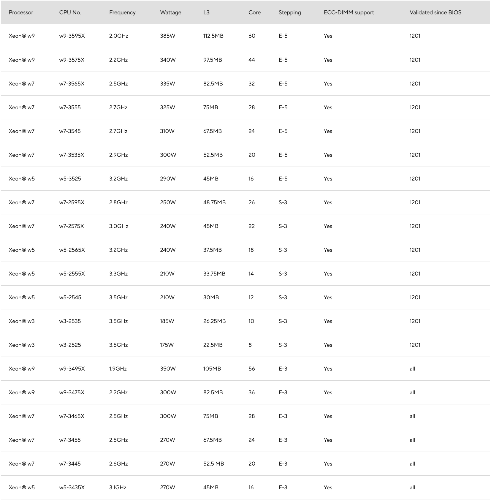
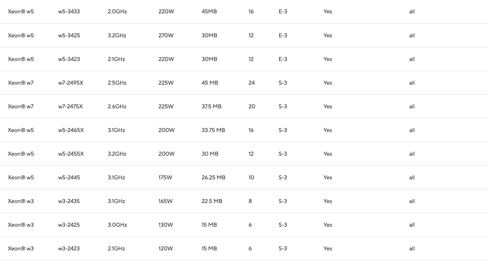

*Frank* happened to have a Sapphire Rapids Q03J
[engineering/qualification sample CPU](https://www.intel.com/content/www/us/en/support/articles/000056190/processors.html)
with 60 (!) cores for the LGA4677 socket that he wanted to sell anyway,
and he also had access to an ASUS Pro WS W790E-SAGE SE to test it on. 

Unfortunately, the Q03J and SAGE SE combination didn't work. The system didn't boot,
so that option was off the table.
I couldn't find any decent second-hand offers either, which left me with no real choice
but to buy a brand-new CPU.

I would have preferred to use an Intel Xeon W-3400 workstation CPU, but prices on
[galaxus.ch](https://galaxus.ch) and [digitec.ch](https://digitec.ch)
started at around CHF ~1600, which sadly exceeded our budget.
So I had to opt for the cheaper 2000 series.
The best CPU I could find available in swiss stocks was the
[Intel Xeon W5-2455X](https://www.intel.com/content/www/us/en/products/sku/233420/intel-xeon-w52455x-processor-30m-cache-3-20-ghz/specifications.html),
a 12-core CPU with a 3.2 GHz base clock and 64× PCIe Gen5 lanes,
providing enough headroom for potential future expansion at a rather bearable cost of
CHF 1105,-.

### CPU Cooler

There were a couple of CPU cooler options and *Frank* suggested either of:

- [Arctic Freezer 4U-M](https://www.arctic.de/en/Freezer-4U-M/ACFRE00133A)
- [Noctua NH-U14S DX-4677](https://www.noctua.at/en/products/nh-u14s-dx-4677)

Being a happy Noctua client, I just went with the NH-U14S.

There were also liquid cooling options but having had to maintain a liquid cooled CPU
in the past, I didn't feel it was a good fit for this setup and the Noctua NH-U14S
would probably be silent enough anyway.

### Memory

It quickly became apparent that the ongoing RAM shortage had already affected the market,
making it difficult to find suitable DDR5 ECC memory that was both in stock and
reasonably priced.

Fortunately, a
[Corsair DDR5 RDIMM kit (64 GB, 4×16 GB, 5600 MT/s)](https://www.corsair.com/ww/de/p/memory/cma64gx5m4b5600c40/ws-ddr5-ecc-rdimm-64gb-4-x-16gb-ddr5-dram-5600mt-s-cl40-memory-kit-cma64gx5m4b5600c40?srsltid=AfmBOoqui_s5tszCYUdL0V9LaVm9yMa2InibYmad2i-q8kKxW6dvNyz_)
was available on Galaxus, so I picked it right away.

### Storage

The M.2 SSD was the easiest component to decide on. I simply went with a 1TB
[Samsung 990 Pro with a heatsink](https://semiconductor.samsung.com/consumer-storage/internal-ssd/990-pro-with-heatsink/)
being absolutely sure there won't be any problems.
It's widely available, and Digitec even promised next-day delivery.

### PSU

The workstation was supposed to work 24/7 as a server so picking a reliable PSU is quite important.

After careful considering, I went with the
[Corsair RM850e](https://www.corsair.com/ww/en/p/psu/cp-9020249-ww/rme-series-rm850e-fully-modular-low-noise-atx-power-supply-cp-9020249-ww)

### System Case

To be honest - I heavily underestimated the task of finding the right SSI-EEB case.
I mean, a case is just a piece of sheet metal, how hard can it be to find the right
piece of metal, right?!

First, consider the BlueField-2 NIC shown below.

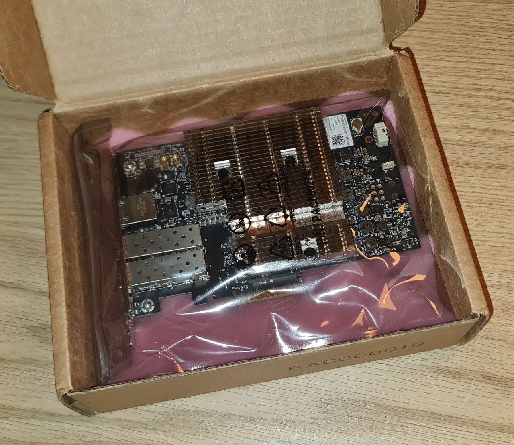

These cards do not have active cooling. They are equipped only with a small, thin
heatsink and are designed to be installed in server racks with **very noisy** high-RPM,
high-pressure airflow. As a result, they run extremely hot under normal operation.

Server-grade hardware like this is typically expected to operate continuously at high
loads, often without dynamic power management. This becomes problematic in a workstation
tower office setup, as it requires a case that allows fans to be mounted in very close
proximity to the cards, to provide sufficient airflow and static pressure to keep them
within safe and sustainable operating temperatures, at least at around 50-60°C
(122-140°F).

I did find the
[Silverstone RM52](http://silverstonetek.com/en/product/info/server-nas/rm52/)
to be an option worth considering:

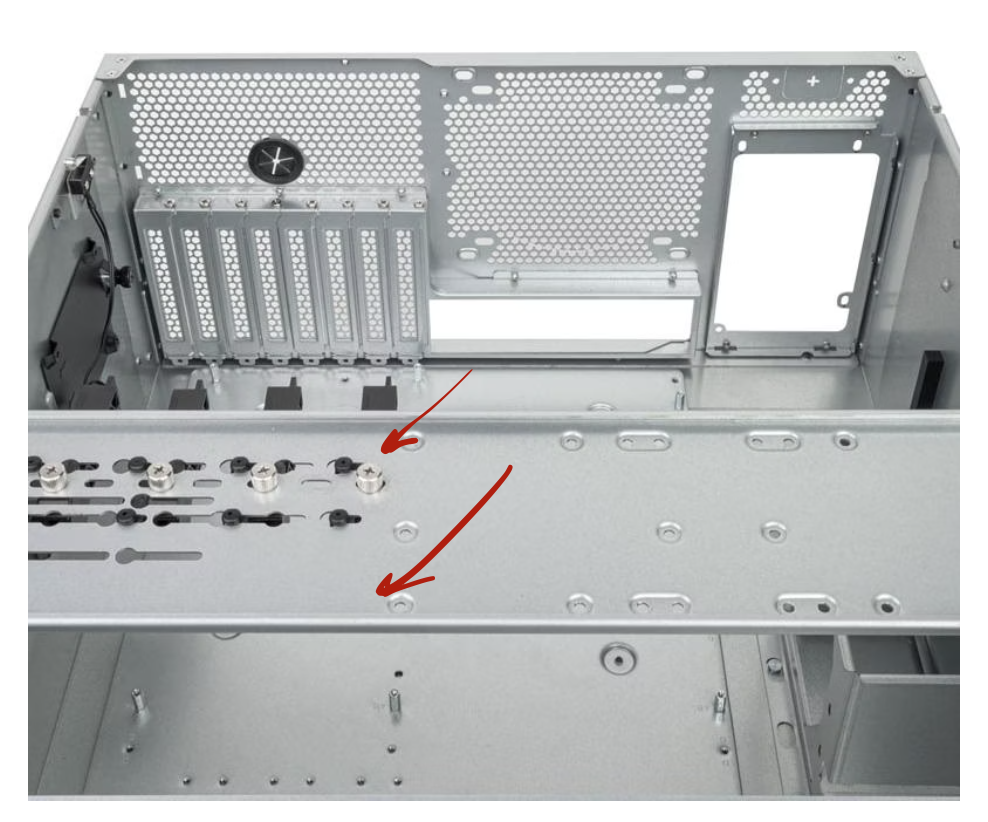

Though at a price of CHF ~450 it was, to put it mildly, too expensive.

---

After nearly losing my sanity browsing both new and second-hand listings,
I finally came across the
[Phanteks Enthoo Pro II](https://phanteks.com/product/enthoo-pro-2-server-edition-tg/)
tower case with a very convenient fan mount:

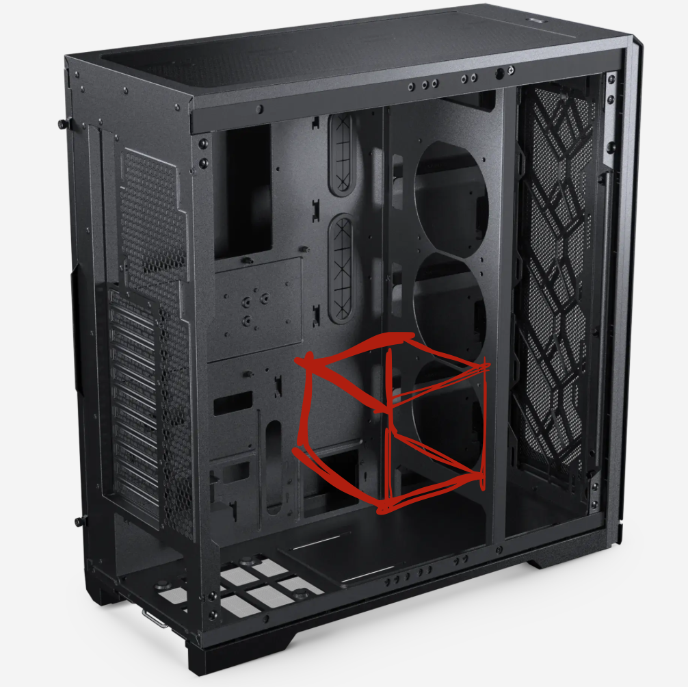

Finally, everything except the case coolers was decided upon and ordered.

## Shopping

The shopping list was finally complete:

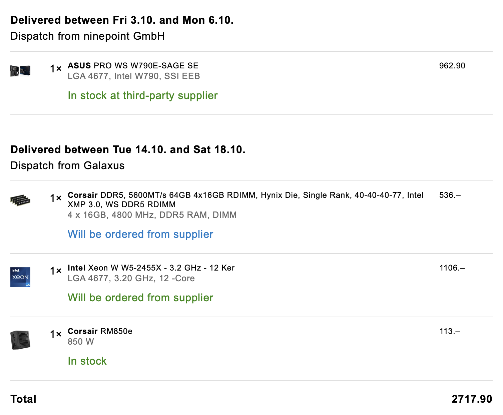
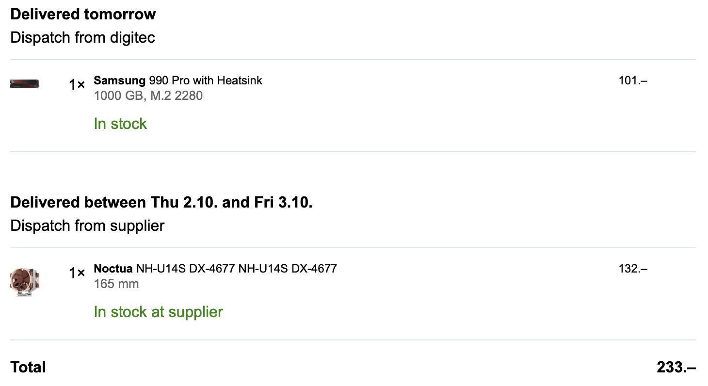

That, plus CHF ~170,- for the Phanteks case, makes a total of CHF 3210,-.
It could probably have been cheaper, but I really wanted to get most of the work done
before heading off on my three-week vacation.

The first components to arrive were the BlueField-2 NICs, followed shortly by the ASUS mainboard, as expected. A bit later, the CPU cooler and the SSD arrived as well.

---

After a significant delay, the CPU, PSU, and RAM finally showed up too.

Even though we paid extra for earlier RAM delivery, it was still delayed - unsurprising, but disappointing nevertheless. In my experience, Digitec/Galaxus delivery time promises
only seem to hold about 50% of the time these days.

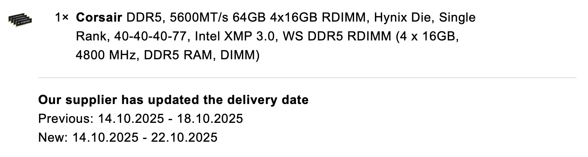

---

The Phanteks case was also significantly delayed. Even though Galaxus initially promised delivery within **2 working days**, they later couldn't even provide an approximate delivery date! What a shame.

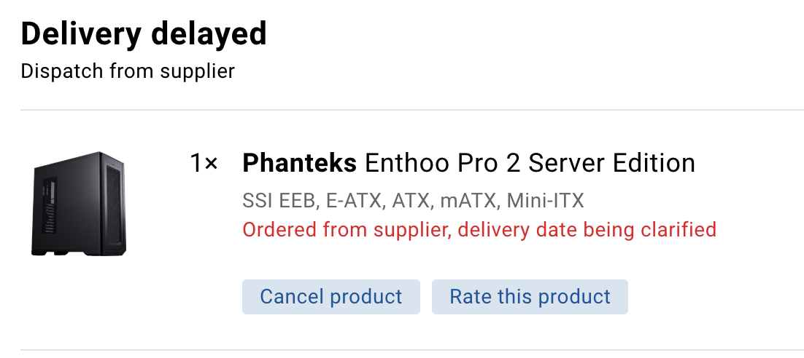

I had to start assembling the system without the case.

---

Last but not least, I needed three
[SFP28 DAC](https://en.wikipedia.org/wiki/Small_Form-factor_Pluggable) cables to interconnect the NICs between each other.
I was honestly surprised by how expensive these cables are. Domestic Swiss offers ranged from CHF 50,- per cable all the way up to CHF 150,-! Of course, there's always the option to order them from China for a fraction of the price, but shipping typically takes 2-4 weeks.

Luckily, I managed to find a few at a much lower price on [Ricardo](https://ricardo.ch)!

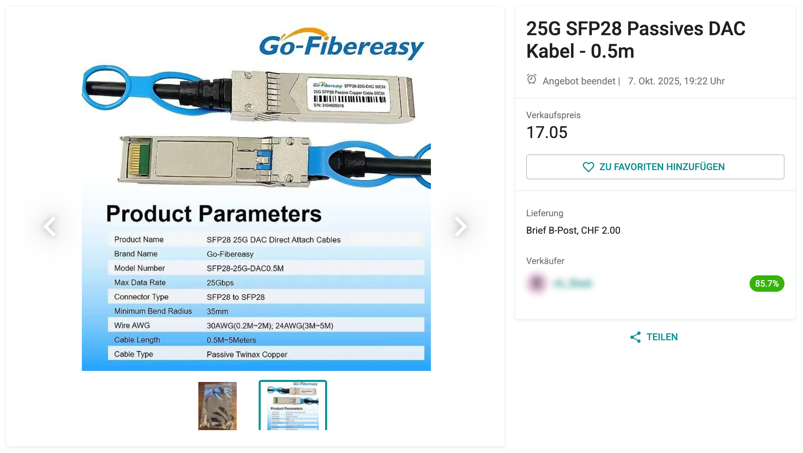

## NIC Firmware Upgrade

### NIC Firmware Upgrade: Installation

Since the cards arrived early, the first thing I had to do was upgrade their firmware.
These cards often ship with outdated firmware, so updating it is essential, otherwise
you may face all sorts of problems and lower performance.

However, since the new workstation system wasn't ready yet, I decided to try installing
them on my ancient gaming rig back from around the 2010s.
The [BigBang X-Power II](https://www.msi.com/Motherboard/Big-Bang-XPower-II/Specification)
PCIe Gen3 should have been enough to run the BF-2 NICs.

Sadly, when I powered it on, it zapped ⚡⚡⚡ and the unmistakable smell of electronic death
quickly filled the room. After more than 11 years of service, my old machine's VRM had
finally given up.


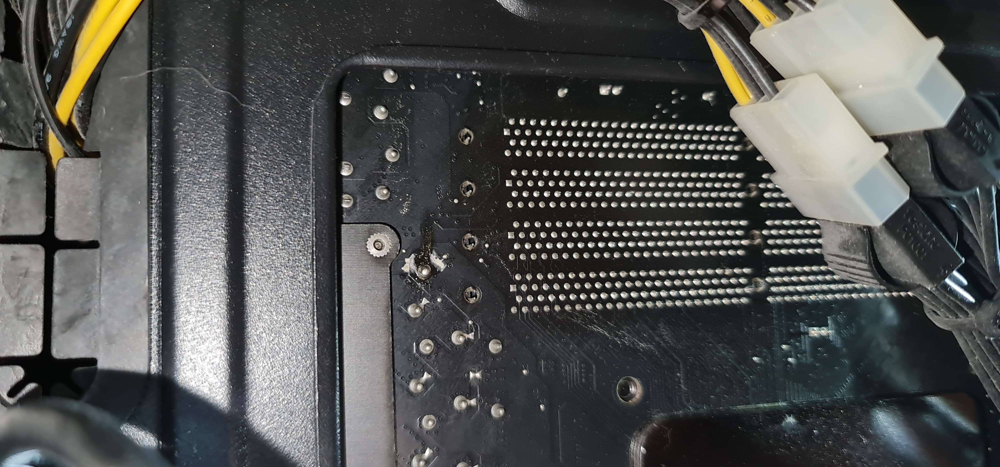

Rest in peace, comrade 🪦.

I won't forget how much fun we had together: Wargame: Red Dragon, Skyrim, The Witcher 3,
Cities: Skylines, Dying Light. There was no game too heavy for you. And you almost got
that 25G NIC running!

Luckily, I have a new gaming PC with Linux on it. I just didn't want to disassemble it,
but now I had no choice. The fans and the fat RTX 3090 with the bracket that prevents
it from bending the PCIe slot under its immense weight needed to be removed and make
space for the tiny BlueField-2.

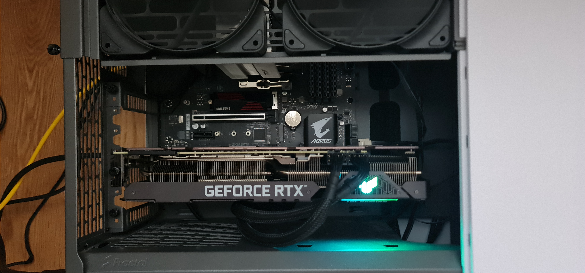

I also installed the new SSD and installed an Ubuntu system on it.

---

When I first booted the gaming PC with the BF-2 NIC installed,
I was a bit scared when I saw UEFI report:

```
mlx5_core - over 120000 MS in pre-initializing state, aborting
mlx5_core: mlx5_init_one failed with error code -110
```

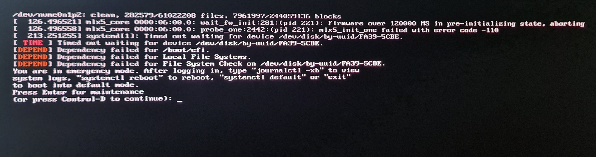

Apparently, this is normal, especially for the very first cold boot.
These BlueField-2 cards are not your regular network card. They're
[DPUs](https://en.wikipedia.org/wiki/Data_processing_unit), which is essentially
an entire PCIe based computer with its own Linux subsystem running on their own
8-core ARM Cortex-A72 CPUs with 16 GB of DDR4 ECC RAM.
No wonder these cards get so hot, they're insane!
On the first boot, this system has to boot and initialize itself,
which apparently makes my UEFI believe that it's dead.
After letting it sit for a while and rebooting again - everything was fine
and I managed to boot into Ubuntu and proceed with the firmware upgrade.

I also checked temperatures, just to be on the safe side, and they appeared to be fine:

```sh
~$ sensors
...
mlx5-pci-0601
Adapter: PCI adapter
asic:         +57.0°C  (crit = +105.0°C, highest = +58.0°C)
...
```

Previously, I removed one of the fans from my old, dead computer and placed it right next to the NIC's heatsink to get some airflow through it. That seems to have been sufficient.

### NIC Firmware Upgrade: NVIDIA DOCA

Before I could do anything with the cards, I needed to install the
[NVIDIA DOCA Host-Server package](https://developer.nvidia.com/doca-3-0-0-download-archive?deployment_platform=Host-Server&deployment_package=DOCA-Host&target_os=Linux&Architecture=x86_64&Profile=doca-all&Distribution=Ubuntu&version=24.04&installer_type=deb_online)
on the freshly installed Ubuntu system, which is fairly easy to do by following
the documentation.

Then I needed to confirm the card is visible on PCIe, and it was:

```sh
lspci | grep Mellanox
06:00.0 Ethernet controller: Mellanox Technologies MT42822 BlueField-2 integrated ConnectX-6 Dx network controller (rev 01)
06:00.1 Ethernet controller: Mellanox Technologies MT42822 BlueField-2 integrated ConnectX-6 Dx network controller (rev 01)
06:00.2 Ethernet controller: Mellanox Technologies Device c2d1 (rev 01)
06:00.3 DMA controller: Mellanox Technologies MT42822 BlueField-2 SoC Management Interface (rev 01)
```

I started the Mellanox software tools driver set:

```sh
sudo mst start
```

And now, I could query the current firmware:

```sh
sudo mlxfwmanager --online
Querying Mellanox devices firmware ...

Device #1:
----------

  Device Type:      BlueField2
  Part Number:      0JNDCM_Dx
  Description:      NVIDIA Bluefield-2 Dual Port 25 GbE SFP Crypto DPU
  PSID:             DEL0000000033
  PCI Device Name:  /dev/mst/mt41686_pciconf0
  Base GUID:        58a2e1030004a9da
  Base MAC:         58a2e104a9da
  Versions:         Current        Available     
     FW             24.36.7506     N/A           
     PXE            3.7.0200       N/A           
     UEFI           14.31.0010     N/A           
     UEFI Virtio blk   22.4.0010      N/A           
     UEFI Virtio net   21.4.0010      N/A           

  Status:           No matching image found

```

The installed firmware `24.36.7506` was clearly not up to date. What I expected to see
there is `24.46.3048`.

So I proceeded to [bfb-install](https://developer.nvidia.com/doca-3-0-0-download-archive?deployment_platform=BlueField&deployment_package=BF-FW-Bundle&installer_type=BFB):

```sh
sudo bfb-install --bfb ~/bf-fwbundle-3.1.0-82_25.07-prod.bfb --rshim rshim0
```

After a while, the upgrade completed successfully, and I had to power down the system
completely for a few seconds so that the new firmware would be used after the reboot:

|        | old version  | new version  |
| :----- | :----------- | :----------- |
| `FW`   | `24.36.7506` | `24.46.3048` |
| `PXE`  | `3.7.0200`   | `3.8.0100`   |
| `UEFI` | `14.31.0010` | `14.39.0014` |

I repeated this process for all three cards. It took a while, but it was simpler than I
had expected.

## Switching From DPU to NIC Mode

As I mentioned earlier, the BlueField-2s are DPUs, not simple NICs. But they can very
well function just like simple 25 Gbit/s NICs if you want them to.
And [this part of the DOCA documentation](https://docs.nvidia.com/doca/archive/2-9-0-cx8/bluefield+modes+of+operation/index.html?utm_source=chatgpt.com#src-3453016816_id-.BlueFieldModesofOperationv2.9.1-NICModeforBlueField-2)
explains how, so I won't repeat the steps here.

This switch is necessary because, in DPU mode, packet processing is routed through the
onboard ARM cores and the embedded switch, which adds unnecessary complexity and latency
for our use case. NIC mode effectively turns the BlueField-2 into a conventional
high-performance NIC and removes the DPU from the data path.

## Assembly

Finally, it was time to start assembling the new SCION workstation. To be honest,
I got a bit nervous. The last system I assembled a system was years ago. I had help from
my younger brother and it wasn't nearly as expensive as this shiny new piece of
workstation hardware.


Before touching any component, I plugged the PSU into the wall and grounded myself on
it to prevent static electricity from damaging the delicate circuitry. This I regularly
repeated throughout the whole process just to be on the safe side.


For the first time in my life, I held a server-grade CPU in my hand - and I have to say, it's massive! Easily two to three times the size of a typical consumer CPU.

<p align="center">
  
  
</p>

The installation process does differ from your regular consumer CPU, and it's
explained in full detail [here](https://www.asus.com/me-en/support/faq/1050029/).

I installed the CPU + cooler, RAM, M.2 SSD, and connected the power wiring:


By the way, the RAM was installed incorrectly, as I later found out and fixed
according to the manual:

```
Intel® Xeon® W-2400 Series Processors do not support
DIMM_C1, DIMM_D1, DIMM_G1, and DIMM_H1
```

---

I clicked the power button, and... it *almost* booted. But something was wrong.
I couldn't SSH into the Ubuntu system I had installed on this M.2 SSD.

*Frank* suggested reseating the CPU, as uneven screw pressure can cause poor contact in
the LGA4677 socket. In that case, the system may fail to boot or lose access to some PCIe
lanes if the pins don't line up perfectly. The Q-code LED displayed `64`, which, according
to the manual, means `CPU DXE initialization is started`. At that point, I assumed
something had to be wrong with either the CPU or RAM. I reseated both multiple times, wasting several hours in the process, but without any success.


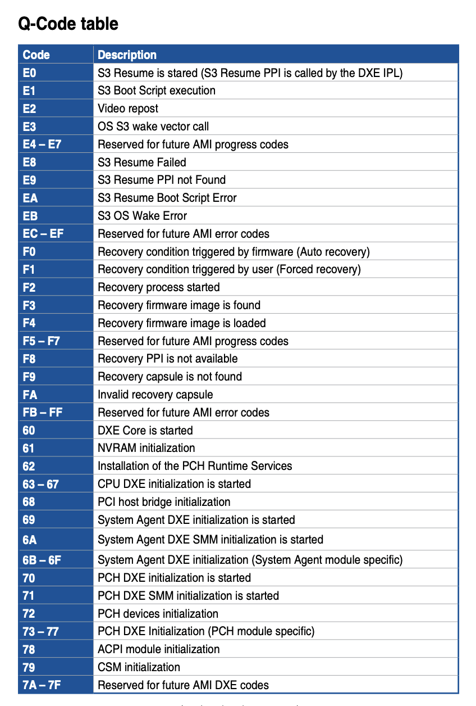 

I even installed the old GTX TITAN GPU, which I previously confirmed to have
worked on another system:


and even though its LEDs lit up I was left with a frustrating "no signal" message on
the HDMI connected display. At this point, I started suspecting the worst.
As you might have guessed - I didn't get a good night's sleep.

The next day, however, I had to confront the sheer size of my own stupidity. If you look
again at the photo of the installed GPU above, you'll notice that - for reasons unknown even to myself - I had installed it in PCIe slot 2, which is not supported by the Intel Xeon W5-2455X.

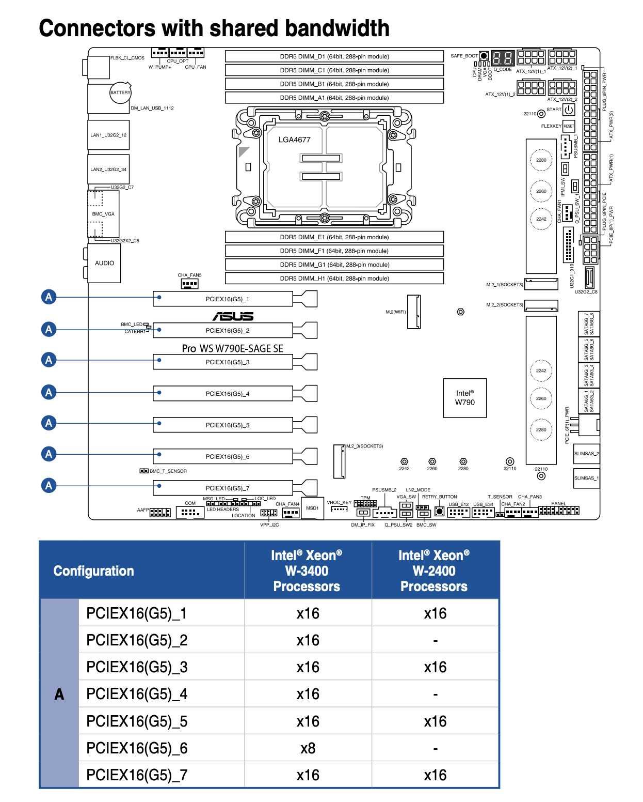

And it turns out, Q-code `64` was just the *last code* displayed and didn't actually indicate any fault at all. In fact, everything was okay.

So I moved the graphics card to PCIe slot 1 and was finally able to enter the UEFI menu, only to run into the next surprise: the M.2 SSD wasn't recognized.

Some time later, I once again realized that I needed to pay closer attention
to the manual:

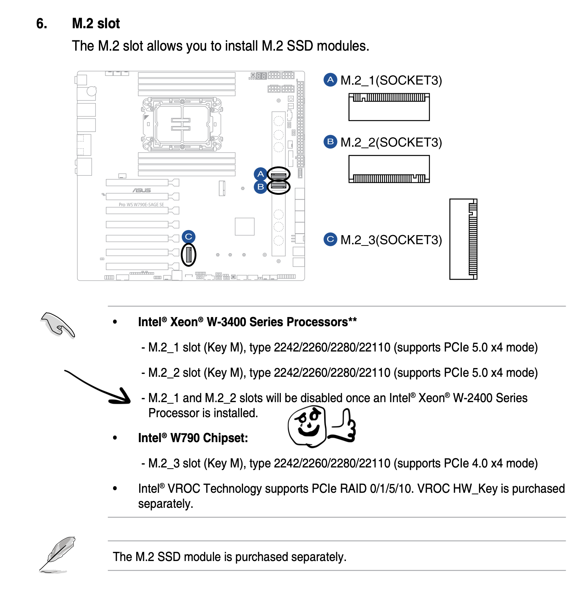

```
M.2_1 and M.2_2 slots will be disabled once an Intel® Xeon® W-2400 Series
Processor is installed.
```

After moving the M.2 SSD to slot 3, everything worked just fine.

## BMC - The Remote Management System

As a proper server-/workstation-grade mainboard, this ASUS SAGE SE has the 
[ASPEED AST2600](https://www.aspeedtech.com/server_ast2600/) remote management system
on it. It allows you to access its web UI over a dedicated ethernet port,
independent of the actual host system and control almost everything remotely,
even if the host system is down or corrupted.
It even gives you screen-sharing remote control.

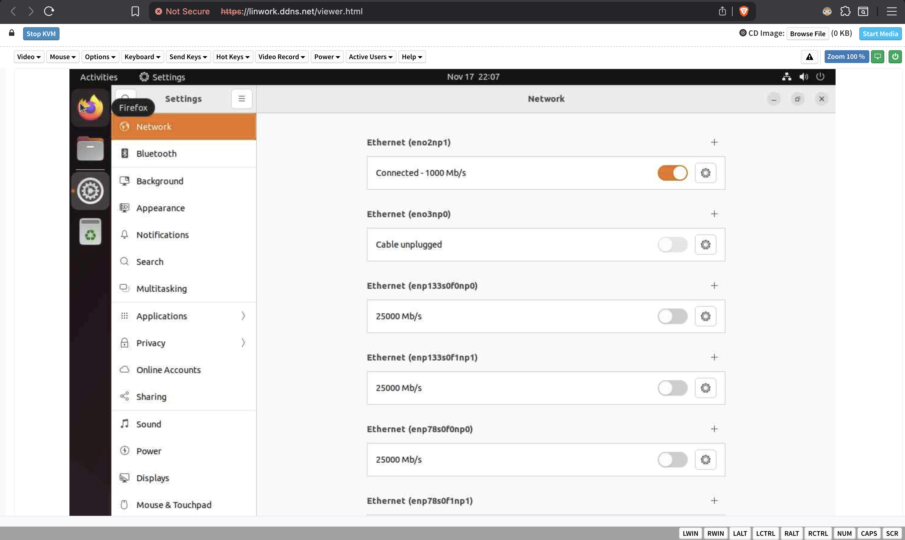

### The BMC Password Bug

The first time I entered the BMC UI, it asked me to change the admin password,
which I did.

Later, when I tried to sign in again, it refused to let me in, claiming I had entered
incorrect credentials - which was simply not true. Long story short: the AST2600 firmware
has a bug. It allows you to set a password that exceeds the maximum supported length
without showing any error. Internally, it appears to hash the overlong string as-is, so
even trimming the password to the maximum length during login doesn't work.
The result is a self-inflicted lockout.

I found it out by using [ipmitool](https://linux.die.net/man/1/ipmitool):

```sh
~ % ipmitool -I lanplus -H 192.168.1.152 -U admin -P $PASS chassis status lanplus: password is longer than 20 bytes.
```

The only way to recover from this is to log into the host system and reset the BMC password using `ipmitool`.

## Case Installation

Now that the Phanteks Enthoo Pro II case had finally arrived, it was time to move the system into its new home.

During installation, I accidentally left a standoff in the wrong place.
The motherboard's backplate drew first blood - and I almost cried.

<p align="center">
  
  
</p>

## Cooling and Airflow

The system was finally mounted in the chassis, and the Enthoo Pro II's brackets allowed
me to mount the NIC fan quite elegantly, even if it couldn't be placed perfectly close.

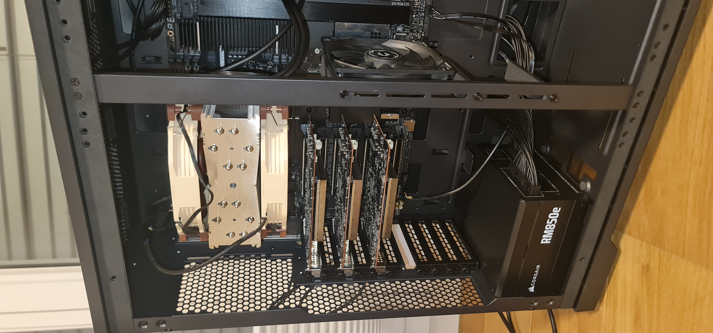

But one last piece of the puzzle was still missing: air circulation.
So I came up with a concept:

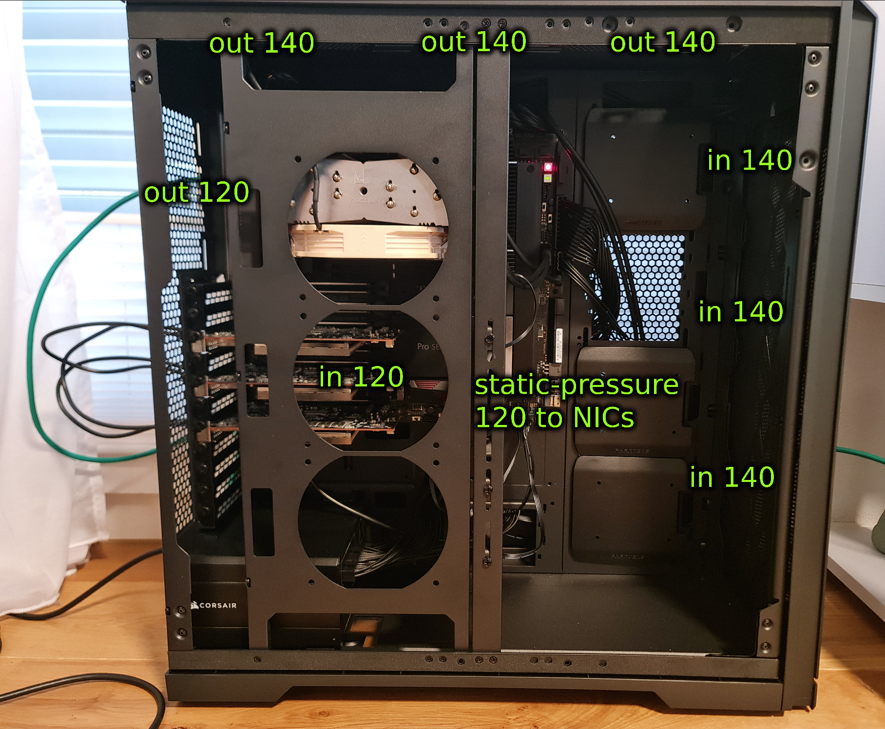

and a new shopping list:

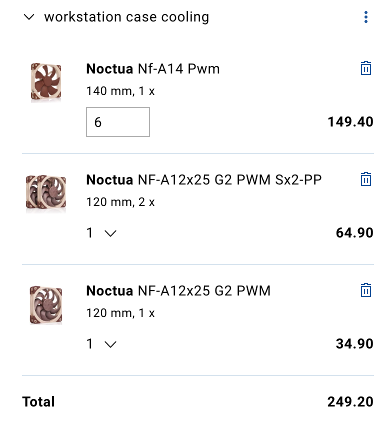

I decided to go with the more expensive Noctua fans again to keep the noise profile as
low as possible. The NF-A12x25 G2 PWM fans are optimized for static pressure, and one of
them would be responsible for providing sufficient airflow through the NIC heatsinks.

A short while later, they arrived:


And I had *lots* of fun installing them. Just kidding - it was tedious work,
and my back hurt so much afterward that not even a good hot bath helped.


Once again, I grossly underestimated the effort required for cable management,
planning, and execution. I even had to reroute and rewire parts of the setup after
realizing that one connector sat far too close to a very hot heatsink -
clearly asking for trouble.


But in the end, I was really happy with how it turned out:


Cable management was decent. Temperatures were great and sustainable,
and even at 30-50% fan speed the system was barely audible, even in complete silence.

```sh
~$ sensors
coretemp-isa-0000
Adapter: ISA adapter
Package id 0:  +23.0°C  (high = +92.0°C, crit = +100.0°C)
Core 0:        +21.0°C  (high = +92.0°C, crit = +100.0°C)
Core 1:        +22.0°C  (high = +92.0°C, crit = +100.0°C)
Core 2:        +20.0°C  (high = +92.0°C, crit = +100.0°C)
Core 3:        +22.0°C  (high = +92.0°C, crit = +100.0°C)
Core 4:        +23.0°C  (high = +92.0°C, crit = +100.0°C)
Core 5:        +22.0°C  (high = +92.0°C, crit = +100.0°C)
Core 6:        +21.0°C  (high = +92.0°C, crit = +100.0°C)
Core 7:        +22.0°C  (high = +92.0°C, crit = +100.0°C)
Core 8:        +20.0°C  (high = +92.0°C, crit = +100.0°C)
Core 9:        +20.0°C  (high = +92.0°C, crit = +100.0°C)
Core 10:       +21.0°C  (high = +92.0°C, crit = +100.0°C)
Core 11:       +21.0°C  (high = +92.0°C, crit = +100.0°C)

mlx5-pci-bc01
Adapter: PCI adapter
asic:         +62.0°C  (crit = +105.0°C, highest = +74.0°C)

mlx5-pci-8501
Adapter: PCI adapter
asic:         +57.0°C  (crit = +105.0°C, highest = +66.0°C)

mlx5-pci-4e01
Adapter: PCI adapter
asic:         +59.0°C  (crit = +105.0°C, highest = +70.0°C)

nvme-pci-0100
Adapter: PCI adapter
Composite:    +27.9°C  (low  = -273.1°C, high = +81.8°C)
                       (crit = +84.8°C)
Sensor 1:     +27.9°C  (low  = -273.1°C, high = +65261.8°C)
Sensor 2:     +31.9°C  (low  = -273.1°C, high = +65261.8°C)

mlx5-pci-bc00
Adapter: PCI adapter
asic:         +62.0°C  (crit = +105.0°C, highest = +74.0°C)

mlx5-pci-8500
Adapter: PCI adapter
asic:         +57.0°C  (crit = +105.0°C, highest = +66.0°C)

mlx5-pci-4e00
Adapter: PCI adapter
asic:         +59.0°C  (crit = +105.0°C, highest = +70.0°C)
```

## Configuring For Use

One more thing left to do, was to configure this workstation for upcoming work.
I needed to figure out which NIC is which in Linux and interconnect them.

The easiest way to do so was to connect a card to itself (port 1 -> port 2),
then check `sudo mst status` and write down a map of `/dev/mst/mt*`
to their respective `domain:bus:dev.fn`.

Then check all mst devices `sudo mlxlink -d /dev/mst/mt41686_pciconf1 -p 1` status.
The one where the "Troubleshooting Info - Recommendation" says "No issue was observed"
is the one currently wired one.

Under **/etc/udev/rules.d/10-bf2-names.rules** I placed a new config file
mapping names to their respective MACs (MAC addresses are redacted here):

```txt
### TOP CARD — PCIEX16(G5)_3 — PCI domain:bus:dev.fn=0000:85:00.0
SUBSYSTEM=="net", ACTION=="add", ATTR{address}=="00:00:00:00:00:00", NAME="top_1"
SUBSYSTEM=="net", ACTION=="add", ATTR{address}=="00:00:00:00:00:00", NAME="top_2"

### CENTER CARD — PCIEX16(G5)_5 — PCI domain:bus:dev.fn=0000:4e:00.0
SUBSYSTEM=="net", ACTION=="add", ATTR{address}=="00:00:00:00:00:00", NAME="center_1"
SUBSYSTEM=="net", ACTION=="add", ATTR{address}=="00:00:00:00:00:00", NAME="center_2"

### BOTTOM CARD — PCIEX16(G5)_7 — PCI domain:bus:dev.fn=0000:bc:00.0
SUBSYSTEM=="net", ACTION=="add", ATTR{address}=="00:00:00:00:00:00", NAME="bottom_1"
SUBSYSTEM=="net", ACTION=="add", ATTR{address}=="00:00:00:00:00:00", NAME="bottom_2"
```

After reloading I could now easily identify the individual ports by their name.

```sh
sudo udevadm control --reload
sudo udevadm trigger
```

```sh
~$ ip -br link
lo               UNKNOWN        00:00:00:00:00:00 <LOOPBACK,UP,LOWER_UP> 
eno3np0          UP             00:00:00:00:00:00 <BROADCAST,MULTICAST,UP,LOWER_UP> 
eno2np1          UP             00:00:00:00:00:00 <BROADCAST,MULTICAST,UP,LOWER_UP> 
enx96cd268bdb7b  UP             00:00:00:00:00:00 <BROADCAST,MULTICAST,UP,LOWER_UP> 
center_1         UP             00:00:00:00:00:00 <BROADCAST,MULTICAST,UP,LOWER_UP> 
center_2         UP             00:00:00:00:00:00 <BROADCAST,MULTICAST,UP,LOWER_UP> 
top_1            UP             00:00:00:00:00:00 <BROADCAST,MULTICAST,UP,LOWER_UP> 
top_2            UP             00:00:00:00:00:00 <BROADCAST,MULTICAST,UP,LOWER_UP> 
bottom_1         UP             00:00:00:00:00:00 <BROADCAST,MULTICAST,UP,LOWER_UP> 
bottom_2         UP             00:00:00:00:00:00 <BROADCAST,MULTICAST,UP,LOWER_UP> 
docker0          DOWN           00:00:00:00:00:00 <NO-CARRIER,BROADCAST,MULTICAST,UP> 
```


## Moving To The Office

The biggest challenge with our office is that it's located inside a banking
infrastructure company's building. While they do provide a way for us to connect to
the outside, we can't directly access anything on the inside. Unless, of course,
we use Tailscale.

To access the BMC web interface from outside the office, I configured a small Linux
machine in the office, connected to the same switch as the workstation,
and tunneled the connection through Tailscale.

By the way, finding the BMC's LAN IP and MAC address turned into yet another multi-hour
adventure, as they weren't written down anywhere - not in the documentation and
not on the board itself. First, I tried to scan the local network, but that approach
proved futile. Later, I connected my Macbook to the management port directly via
ethernet cable and used `tcpdump` to inspect the traffic and determine the MAC.
Unfortunately, it seems like the ASPEED AST2600 BMC doesn't speak proper
[ARP](https://en.wikipedia.org/wiki/Address_Resolution_Protocol).
There is however a short window of time right after a cold boot of the system
when it sends ICMPv6 packets, which reveal its MAC.

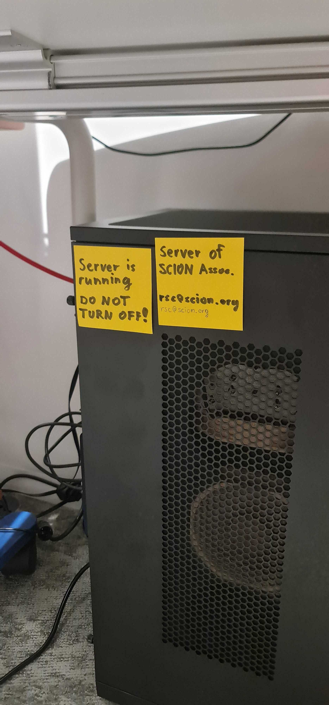

## First tests

I started writing AF_XDP experiments, and you can find the code at:
[github.com/romshark/afxdp-bench-go](https://github.com/romshark/afxdp-bench-go)

Eventually, I managed to send 1.5 TB of data in just over eight minutes from one card to
another at 24.6 Gbit/s (practically line rate), using an MTU of 1500 bytes per packet:

```sh
FINAL REPORT
 Elapsed:           487.657 s
 TX:                1,000,000,000 packets
 RX:                1,000,000,000 packets
 TX Avg PPS:        2,050,621
 RX Avg PPS:        2,050,621
 TX Avg rate:       24,607.5 Mbps
 RX Avg rate:       24,607.5 Mbps
 Dropped:           0 (0.0000%)

real    8m10.217s
user    0m0.009s
sys     0m0.017s
Requested TX:       1000000000
Egress:
  tx_packets_phy delta: 1000000126
  tx_bytes_phy   delta: 1504000017713
Ingress:
  rx_packets_phy delta: 1000000126
  rx_bytes_phy   delta: 1504000017713
```

## Complete Components List

| Component                                                        | Quantity   | Retailer        | Price                                          |
| :--------------------------------------------------------------- | :--------- | :-------------- | :--------------------------------------------- |
| ASUS Pro WS W790E-SAGE SE (LGA4677, Intel W790, SSI EEB)         | 1          | digitec.ch      | CHF 962.90                                     |
| Intel Xeon W5-2455X (3.2 GHz, 12-core)                           | 1          | galaxus.ch      | CHF 1106.00                                    |
| Corsair DDR5 RDIMM 64 GB (4×16 GB, 5600 MT/s, ECC)               | 1          | galaxus.ch      | CHF 536.00                                     |
| Corsair RM850e (850 W)                                           | 1          | galaxus.ch      | CHF 113.00                                     |
| Samsung 990 Pro w/ Heatsink (1 TB, M.2 2280)                     | 1          | digitec.ch      | CHF 101.00                                     |
| Noctua NH-U14S DX-4677 CPU cooler                                | 1          | digitec.ch      | CHF 132.00                                     |
| Phanteks Enthoo Pro II Server Edition TG (SSI-EEB)               | 1          | galaxus.ch      | ~CHF 170.00                                    |
| Noctua NF-A14 PWM (140 mm)                                       | 6          | digitec.ch      | CHF 149.40                                     |
| Noctua NF-A12x25 G2 PWM Sx2-PP (120 mm, 2-pack)                  | 1 (2 fans) | digitec.ch      | CHF 64.90                                      |
| Noctua NF-A12x25 G2 PWM (120 mm)                                 | 1          | digitec.ch      | CHF 34.90                                      |
| Mellanox/NVIDIA BlueField-2 BF2H532C dual-port 25G (PCIe 4.0 x8) | 3          | piospartslap.de | 289,92 €<br>+ 49,99 € shipping<br>(CHF 318.09) |
| 25G SFP28 passive DAC cable 0.5 m                                | 3          | ricardo.ch      | CHF 51.15<br>+ CHF 2.00 shipping               |
| **Grand Total**                                                  |            |                 | **CHF 3,741.34**<br>(≈$4,700 USD)              |
